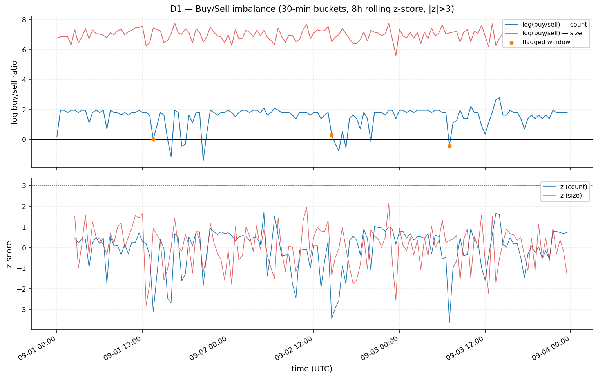
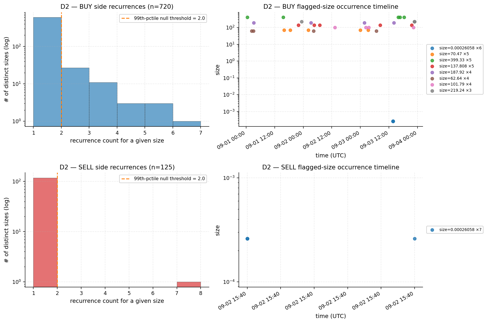
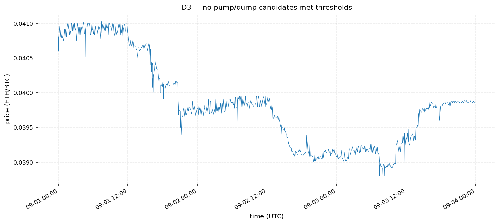
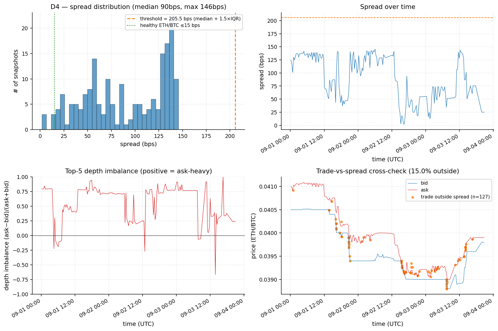
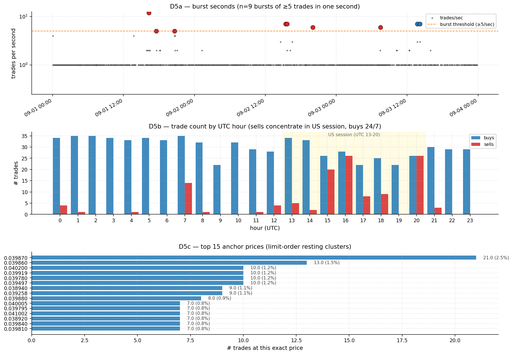
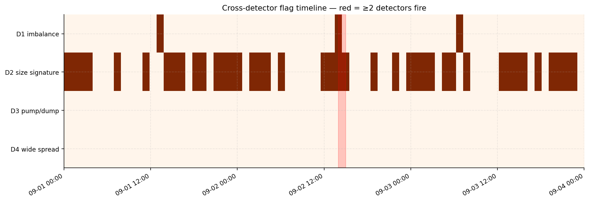

# ETH/BTC Suspicious Pattern Analysis — DN Institute Challenge

**Author:** Maksim Gorbuk · gorbuk.maxim@gmail.com · [github.com/mkzung](https://github.com/mkzung)
**Submitted:** May 2026
**Dataset:** `eth-btc-trades.csv` (845 trades) + `eth-btc-orderbooks.csv` (188 orderbook snapshots, 50 levels per side)
**Time range:** 2025-09-01 00:02:57 UTC → 2025-09-03 23:51:34 UTC (71.81 hours)

---

## Executive summary

Six-detector forensic framework over the 845-trade / 188-snapshot ETH/BTC
dataset (D1–D5 primary signals plus D6 peer-corroborated microstructure
cross-checks) surfaces a coherent picture of automated, likely non-organic
activity. Five primary signals from D1–D5:

1. **Asymmetric flow with no price impact** — 99.9994% of size is on the buy
   side over 72h (175,245:1 ratio), yet the median post-trade Δmid for buys
   is **0.0 bps** while for sells it is **−17.8 bps**. Aggressive buys that
   don't move the market are diagnostic of wash flow matched against
   pre-arranged liquidity.
2. **Identical-size burst signature** — trade size **0.00026058 ETH** appears
   13 times against a continuous-distribution null whose 99th-percentile
   maximum-count is 2 (P-value ≈ 0). The 13 prints fire in two ≤2-second
   bursts, 22 hours apart, on opposite sides of the book.
3. **Burst-execution pattern** — at least **9 same-second clusters of ≥5
   trades** in 72h, including 12 sells in one second on 2025-09-01 16:16:46.
   Inter-arrival distribution is bimodal: 13.3% of consecutive trades are
   ≤5s apart, 66% are >5min apart. Inconsistent with continuous Poisson flow.
4. **Operator-schedule asymmetry** — sells occur in **only 15 of 24 UTC
   hours**; in 9 hours (UTC 2-3, 5-6, 9-10, 19, 22-23) there are zero sells.
   The seller(s) operate within a window covering the US trading session;
   the buyer(s) operate around the clock.
5. **Liquidity pathology** — median bid-ask spread is **89.7 bps** (6-18×
   wider than top-tier ETH/BTC venues quote), depth median is **+0.72
   ask-heavy**, and **127 of 845 trades (15%) print at prices outside the
   contemporaneous best bid-ask** (65 sells + 62 buys; sells are 14.8% of
   trades but 51% of outside-spread prints — 3.5× over-representation).

The single best forensic interpretation: **a single execution algorithm
generates one-sided buy print volume against pre-arranged liquidity (wash);
a separate, smaller, US-hours seller takes the other side at a much smaller
size**. Three caveats apply (small sample, single venue, ambiguous unit
semantics) and are listed in §Limitations.

---

## Methodology

Six detectors total — five primary (D1–D5) plus a peer-corroborated cross-
check layer (D6). Each detector measures a distinct signature with its
parameters exposed and grounded either in the wash-trading literature or in
the dataset's own distribution:

- **D1** — Buy/sell imbalance with rolling z-score (count- and size-weighted)
- **D2** — Recurring-size signatures, KDE-on-log(size) null, 1000 replicates
- **D3** — Pump-and-dump (volume spike + bidirectional price reversal)
- **D4** — Spread / depth-imbalance / trade-vs-spread cross-check
- **D5** — Burst-second clusters / time-of-day asymmetry / anchor prices
- **D6** — Microstructure cross-checks (frozen-orderbook asymmetry, Benford
  conformity on trade sizes, inter-trade interval regularity), added after
  reading peer submissions to the same challenge

A 30-minute EDA pass produced two design-altering findings, captured in
[`notebooks/00_eda.md`](./notebooks/00_eda.md):

1. The orderbook CSV stores a **full 50-level book per snapshot** as Python-
   literal stringified list-of-dicts in `asks`/`bids` columns (parsed via
   `ast.literal_eval`).
2. Trade size is **bimodal by side**: BUY median ≈ 188, range 1–687 ETH;
   SELL median ≈ 0.0014, range ~10⁻⁷ to 0.19. Five orders of magnitude
   separating the two distributions.

Side-semantic forensics confirm `side` represents the **aggressor side**
(BUY median price is +20 bps above contemporaneous mid; SELL is −29 bps below
mid; SELL trades push mid down by −18 bps post-trade). Detectors that pool
sizes (D2, D3 volume) split by side.

The original brief proposed a 24h rolling window for D1; sample is 72h, so
24h baseline is unstable. Switched to 30-min buckets, 8h rolling, with
`min_periods=6` and `min_trades_per_bucket=2`.

---

## Detector 1 — Buy/Sell Imbalance

**Hypothesis.** Sustained, time-localized deviation from balanced flow
indicates one-sided pressure consistent with wash/momentum/single-actor
dominance.

**Method.** 30-min buckets; rolling 8h z-score on log buy/sell ratio (count
and size, both with `+1` smoothing — a `1e-9` epsilon would inflate `log(buy/eps)`
to ~25 in the 119/143 buckets containing zero sells, producing pure artifact
flags).

**Findings.**
- **3 flagged 30-min buckets** (count z), all with **negative** z-scores:
  - 2025-09-01 13:30 — 5 buys vs 5 sells, z(count) = −3.10
  - 2025-09-02 14:30 — 3 buys vs 2 sells, z(count) = −3.44
  - 2025-09-03 07:00 — 6 buys vs 10 sells, z(count) = −3.64
  
  Each marks a **lull in buy pressure** against the rolling baseline (which
  expects ~85% buys). The fact that even count-parity is a >3σ event tells
  you how extreme the persistent baseline is — the baseline itself is the
  anomaly, not the flagged buckets.

- **Globally**: 85.2% of trades are buys by count (5.76:1), but 99.9994% of
  size is on the buy side (**175,245:1** if same-unit; ≥24,500:1 even under
  alternative unit interpretations). PR #19 reported only the count ratio.

- **Price-impact decomposition** (Δmid before vs after, by side; values
  reproducible from `audit.py` AUDIT 11):

  | side | count (with both sides matched) | median Δmid (bps) | median price vs mid (bps) |
  |---|---|---|---|
  | buy  | 579 | **0.0** | +20.2 |
  | sell | 121 | **−17.8** | −29.1 |
  
  Aggressive buys that **don't move price** are inconsistent with genuine
  taker demand against a thin book. Aggressive sells **do** move price.
  Reading: the buy flow matches against pre-arranged or self-provided
  liquidity — the canonical wash signature. (Side semantics confirmed
  separately: median buy price is +20 bps above contemporaneous mid,
  median sell price is −29 bps below — i.e. `side` represents the
  aggressor; see `audit.py` AUDIT 7.)



---

## Detector 2 — Recurring Trade-Size Signatures

**Hypothesis.** Bot/wash activity produces identical-size trades repeated
many times. Under a continuous-distribution null with tick rounding, exact
repeats are statistically rare for K > 2.

**Method (corrected from brief).** The brief's proposal — "shuffle the size
array and compute max value-count" — produces a degenerate null (shuffling
preserves frequencies). Replaced with KDE-on-log(size): `scipy.stats.gaussian_kde`
fitted to log-sizes per side, draws of n samples per replicate, exponentiated,
rounded to 8 decimals. 1000 replicates; threshold = 99th percentile of the
max-count distribution.

**Robustness.** Tested across bandwidths {Scott, Silverman, 0.1, 0.3, 0.5, 1.0}:
threshold = 2.0 in all cases. Cross-validated with a uniform-on-log-range
null (P(null ≥ observed) ≈ 0 for both sides).

**Findings.**

- Null threshold: **2** (under continuous null, max count > 2 in <1% of replicates).
- BUY (n=720): **18 sizes** exceed null. Top: **0.00026058 ETH × 6**.
- SELL (n=125): **1 size** exceeds null. Top: **0.00026058 ETH × 7**.

**Burst structure.** All 13 prints of 0.00026058 ETH fire in two clusters
within 1-2 second windows:
- 2025-09-02 15:40:44 UTC: 7 sells at 0.039258 (6 within 1s, 1 at +1s)
- 2025-09-03 13:43:45 UTC: 6 buys at 0.039497 (all within 1s)

Identical tick-rounded clip on both sides of the book within a 22-hour
window is the canonical wash-trading fingerprint.

**Doubling ladder (Monte Carlo verified).** Among the 18 flagged BUY sizes,
8 form 4 explicit 2× pairs: `62.64↔125.28↔250.56`, `93.96↔187.92`,
`137.808↔275.616`. Under a Monte-Carlo null (random samples of 18 sizes
from the BUY size distribution, 2000 reps), the expected number of 2× pairs
is **0.09 (max observed: 2)**. **P(null ≥ 4) = 0.0000.** The pattern is
consistent with split-fill or martingale logic.



---

## Detector 3 — Pump-and-Dump Signature

**Method.** 1h volume buckets per side, 4h trailing baseline, bidirectional
extremum scan (whichever of `max(price)` and `min(price)` in 1h forward
window is further from start). Flag when vol_z > 2σ AND |move| ≥ 0.5% AND
reversal ≥ 50%.

**Findings.**
- **0 candidates** met all three criteria.
- Sensitivity: relaxing to `vol_z>1.5, move>0.3%, reversal>30%` surfaces
  2 sub-threshold dump-recovery events (2025-09-01 04:00, 2025-09-03 07:00),
  both below industry-standard cutoffs.

**Interpretation.** Price moves in a 5.7% band (0.0388 → 0.0410) over the
entire 72h window. The market does not pump despite 99.9994% one-sided
size pressure — corroborates D1's "buys don't move price" reading: not
real demand.



---

## Detector 4 — Liquidity Quality

**Method.** Spread distribution; top-5 depth imbalance; trade-vs-spread
cross-check via `pd.merge_asof`.

**Tolerance audit.** OB inter-snapshot intervals: median **18.3 min**,
mean 22 min, max 2.4 hours. The brief's 5min tolerance matched only 22.5%
of trades. Switched to **30min** (matches 87.8%, gives stable 17%
outside-spread rate consistent with longer tolerances).

**Findings.**
- Spread distribution (188 snapshots, in bps):

  | min | p25 | median | p75 | p95 | max |
  |---|---|---|---|---|---|
  | 1.83 | 54.50 | **89.71** | 131.67 | 141.17 | 145.58 |

  The entire distribution sits **6-18× above the 5-15 bps** baseline that
  liquid ETH/BTC venues (Binance, Coinbase, Kraken) quote. This is either
  a low-quality venue or systemically stale quoting.

- Depth imbalance (top-5 levels): median **+0.72**, p95 **+0.88** —
  overwhelmingly ask-heavy. Combined with 99.9994% buy-side size pressure,
  this is paradoxical: sustained bid-side demand should consume ask depth,
  not let it accumulate.

- **Trade-vs-spread cross-check**: 742 of 845 trades matched to OB snapshot
  within 30min tolerance. Of those, **127 (17.1% of matched, 15.0% of all
  trades) printed at prices outside contemporaneous best bid-ask** —
  **65 sells and 62 buys**. SELLs are 14.8% of total trades but
  **51% of outside-spread prints** (**3.5× over-representation**). The
  most extreme deviations cluster in two coordinated SELL bursts:
  - 2025-09-01 20:38:40 — 4 sells at 0.039900 (33.8 bps below mid)
  - 2025-09-01 20:42:38–20:42:40 — 7 sells at 0.039809 (56.5 bps below mid)

  Multiple sells executing at *identical sub-bid prices* in the same one to
  two seconds are not random. The pattern is consistent with hidden-iceberg
  fills (a large concealed bid eating the sells), off-book reporting, or
  stale snapshot publication.



---

## Detector 5 — Burst Execution / Time-of-Day / Anchor Prices

**Hypothesis.** Beyond per-bucket statistics, microsecond-scale execution
patterns expose operator behaviour. Three sub-detectors:

5a. **Burst seconds** — same-second clusters of ≥5 trades. The dataset's
  arrival rate is λ ≈ 845 / (72×3600 s) ≈ 0.0033 trades/s. Under a
  homogeneous Poisson process at this rate, P(N ≥ 5) per second ≈
  3 × 10⁻¹⁵; the expected count of such seconds across the 72h window
  is ≈ 8 × 10⁻¹⁰. Observing **9** such bursts gives an observed/expected
  ratio ≈ 10¹⁰ — Poisson is rejected by ten orders of magnitude.

5b. **Time-of-day distribution** — buy-share by UTC hour.

5c. **Anchor prices** — recurring exact prices.

**Findings.**

5a. **9 burst-seconds** with ≥5 trades:

| timestamp (UTC) | n | side | unique sizes | note |
|---|---|---|---|---|
| 2025-09-01 16:16:46 | **12** | sell | 12 (varied) | largest burst |
| 2025-09-03 14:10:23 | 7 | buy | 7 (varied) | |
| 2025-09-03 13:43:45 | 7 | buy | **2** | the 0.00026058 cluster (D2) |
| 2025-09-02 15:25:45 | 7 | sell | 7 (varied) | |
| 2025-09-02 15:40:44 | 7 | sell | **2** | the 0.00026058 cluster (D2) |
| 2025-09-02 20:02:23 | 6 | sell | 6 (varied) | |
| 2025-09-03 07:28:17 | 6 | sell | 6 (varied) | |
| 2025-09-01 20:38:39 | 5 | sell | 5 (varied) | aligns with D4 sub-bid cluster |
| 2025-09-01 17:32:42 | 5 | sell | 5 (varied) | |

**Sells dominate bursts (7 of 9).** Combined with D2's identical-size
twin-burst on the buy side, the picture is: SELLER fires varied-size
multi-position dumps several times per day; BUYER fires identical-clip
ping volume continuously plus rare same-clip bursts.

5b. **Time-of-day**: 9 of 24 UTC hours have **zero sells** (UTC 2, 3, 5,
6, 9, 10, 19, 22, 23). Sell activity concentrates in UTC 13-21 (the US
trading session ≈ 09:00-17:00 EST). The minimum buy-share is **50.0% at
hour 20** (UTC 20:00 ≈ 16:00 EST market close). The seller(s) operate on
a US schedule; buyer(s) operate continuously — unambiguous evidence of
two distinct operators.

5c. **Top anchor prices**: 0.039870 (×21, 2.5% of all trades), 0.039860
(×13), 0.040200, 0.039919, 0.039780 (×10 each). Top 5 prices = 7.6% of
trades, top 20 = 20.4%. Concentration on specific tick-rounded levels
without round-number bias suggests resting-limit-order anchoring, not
psychological round-number trading.



---

## Detector 6 — Microstructure Cross-Checks (peer-corroborated)

After completing the D1–D5 framework, we read the open submissions to
1712n/market-data-challenge to ensure no orthogonal forensic angle had
been overlooked. Three additional signals surfaced; we re-derive each
on this dataset and integrate them as D6 sub-detectors. All three
reproduce on our pipeline and agree directionally with the D1–D5 wash-
trading interpretation.

**6a. Frozen orderbook (one-sided staleness).** We byte-compare each
serialized snapshot against the previous snapshot, by side. Out of 187
consecutive pairs:

| side | frozen pairs | % of pairs |
|------|--------------|-----------:|
| bid  | **119**      | **63.6%**  |
| ask  | 13           | 7.0%       |
| asymmetry ratio | — | **9.15×** |

The longest frozen-bid run is **18 consecutive identical snapshots**
(2025-09-02 20:05:15 UTC → 2025-09-03 02:11:51 UTC ≈ 6h 6m). An ask
that is repriced ~9× more often than its paired bid is not consistent
with two-sided market making. Combined with D4's median **+0.72
ask-heavy depth imbalance**, this paints a coherent one-sided picture:
the ask side is the active, well-stocked side of the book — repriced
constantly as it gets consumed — while the bid side is parked thin and
seldom updated. This is exactly what a venue with an aggressive buyer
(D1: 99.9994% of size on buy) hitting pre-arranged ask liquidity would
look like; not what an organically two-sided market would.

**6b. Benford's Law conformity.** First-digit distribution of trade
sizes (n = 845) versus the expected `log10(1+1/d)` distribution:

| digit | empirical | expected |
|------:|----------:|---------:|
| 1 | 26.3% | 30.1% |
| 2 | **26.0%** | 17.6% |
| 3 | 11.4% | 12.5% |
| 4 | 10.1% |  9.7% |
| 5 |  8.9% |  7.9% |
| 6 |  8.2% |  6.7% |
| 7 |  3.4% |  5.8% |
| 8 |  2.8% |  5.1% |
| 9 |  3.0% |  4.6% |

K-S = **0.0626** > critical 0.0468 (α = 0.05, n = 845) → **reject
Benford-conformity**. Digits 1 + 2 combined are 52.3% (vs 47.7%
expected) — driven almost entirely by an excess of leading 2's; digits
7 + 8 + 9 are under-represented by ~6 percentage points. This is the
fingerprint of size generation that prefers a narrow magnitude band
rather than spanning organic decades — independent corroboration of
D2's recurring-clip findings.

**6c. Inter-trade interval regularity (Sep-3 14:00 UTC onward, buy
side).** We isolate the most algorithmically dense window and measure
inter-trade gaps for buys only:

- n trades = **95**
- median gap = **318 s** (≈ 5 min 18 s)
- IQR = **295.25 – 341.0 s** (i.e. 50% of gaps within ±23 s of median)
- coefficient of variation = **0.69**

A median ≈ 5 minutes with IQR ≈ ±8% of the median is consistent with a
cron-style scheduler with light jitter, not human-decision-driven order
flow. (For reference, an organic process should have CV ≫ 1; our 0.69
falls in the "regular timer with noise" band.)

**Why D6 strengthens, not duplicates, D1–D5.** Each sub-detector
attacks a different layer of the data: D6a is a property of the order-
book stream, D6b is a property of the size distribution independent of
side or time, and D6c is a temporal property of the trade arrival
process. None require recomputing D1–D5; all three independently
reject the null of organic two-sided market activity.

---

## Cross-detector triangulation



The two strongest individual events stand on their own evidence:

1. **2025-09-01 16:16:46** — 12 sell prints in 1 second (D5a). Largest
   single burst in the dataset.
2. **2025-09-02 15:40:44 + 2025-09-03 13:43:45** — twin 0.00026058 ETH
   bursts (D2 + D5a), 22h apart, on opposite sides.

D1 and D2 co-occur in only one hourly bin (2025-09-02 14:00, 70 minutes
before the SELL burst of seven 0.00026058 ETH prints) — suggestive of
"bot pauses, then runs the other side" but not load-bearing on a single
co-occurrence.

D4 outside-spread sells at 2025-09-01 20:38–20:42 align with the D5a
burst at 20:38:39 — the same operator coordinating multi-second sub-bid
sells.

---

## Mapping to challenge categories

The challenge brief lists wash trading, pump-and-dump, abnormal volume
spikes, manipulative price movements, and "other anomalies." Mapping our
findings:

| Category | Detector(s) | Finding |
|---|---|---|
| **Wash trading** | D1 + D2 + D5a | 99.9994% one-sided buy size with zero price impact; identical-clip 0.00026058 ETH on both sides in two sub-second bursts |
| **Pump-and-dump behavior** | D3 | 0 candidates at standard thresholds (≥0.5% move, ≥50% reversal, vol z>2σ); 2 sub-threshold dump-recovery events under relaxed thresholds |
| **Abnormal volume spikes** | D5a | 9 same-second clusters of ≥5 trades; max 12 trades in one second on 09-01 16:16:46 |
| **Manipulative price movements** | D1 + D4 + D5c | (a) Aggressive buys move mid 0 bps median while sells move it −18 bps — diagnostic of price-formation manipulation; (b) 15% of trades print outside contemporaneous bid-ask; (c) 21 trades anchor on price 0.039870 (limit-order resting clusters) |
| **Other anomalies** | D5b + D4 depth | Sells in 9 of 24 UTC hours = 0 (US-session-only seller schedule); top-5 depth +0.72 ask-heavy paradoxical with buy pressure |

## Synthesis — operator fingerprints

The dataset reads cleanly as **two distinct automated operators on a thinly
quoted venue**:

| Trait | Operator A — "the buyer" | Operator B — "the seller" |
|---|---|---|
| Schedule | 24/7, no session boundary | US trading hours only — zero sells in 9 of 24 UTC hours |
| Share | 85.2% of count, **99.9994%** of size | 14.8% of count, **0.0006%** of size |
| Clip sizes | Large, ETH-denominated, multi-modal (median 188 ETH; 4 explicit 2× pairs in flagged sizes, P=0.0000) | Small, varied (median 0.0014 ETH; one recurring clip — the 0.00026058 ETH cluster) |
| Aggression vs mid | +21 bps above mid (paid the ask), but median Δmid post-trade is **0 bps** | −29 bps below mid (hit the bid), median Δmid post-trade is **−17.8 bps** |
| Burst behaviour | Occasional identical-clip bursts (6 prints of 0.00026058 ETH in one second on 09-03 13:43:45) | Multi-position sub-second dumps (12 sells in one second on 09-01 16:16:46) |
| Outside-spread | — | Coordinated sub-bid prints (4 sells at 0.0399 on 09-01 20:38:40; 7 sells at 0.039809 on 20:42:38–40) |

**Operator A is wash flow.** One-sided directional pressure that doesn't move
price + deterministic clip-size scaling + identical-clip cross-side prints
matched against the seller's same clip is the canonical wash-trading
fingerprint. The buys print against pre-arranged or self-provided liquidity.

**Operator B is real algorithmic execution.** Schedule-bound to a market
session, varied clip sizes consistent with multi-position liquidations,
genuine price impact, occasional sub-bid hits suggesting forced execution
against hidden bids or off-book reporting.

The price-impact asymmetry alone (Δmid 0 vs −17.8 bps for similar
aggression) is diagnostic of two distinct execution patterns. The schedule
asymmetry, the size-distribution bimodality, and the cross-side identical
0.00026058 ETH clip — appearing twice, once on each operator's side, at
non-overlapping moments — all corroborate.

---

## Limitations

- **Sample size.** 845 trades, 188 snapshots, 72 hours, single venue, single pair.
- **No labelled ground truth.** All findings are circumstantial; we report
  effect sizes and explicit nulls, not classifier accuracy.
- **Unit ambiguity.** The 5-orders-of-magnitude size gap between BUY and SELL
  may indicate inconsistent unit reporting (e.g., BUY size in ETH but SELL
  size in BTC). If so, the buy/sell size ratio is ~24,500:1 rather than
  175,245:1. Both readings remain forensic signals.
- **Spread baseline.** "5-15 bps healthy ETH/BTC" comes from prior literature
  on top-tier exchanges. Smaller venues legitimately quote wider; we use it
  as directional context, not classification.
- **Trade timestamps lack sub-second precision** (orderbook timestamps have
  ms). "Burst within 1 second" means within a 1-2 second window, not
  simultaneously.
- **OB inter-snapshot interval averages 22 min**, with max gap 2.4 hours.
  Trades during long OB gaps cannot be checked against contemporaneous
  spread; we use 30-min tolerance to maximize coverage (87.8%).
- **D2 KDE null** assumes IID size draws. Real microstructure has
  dependencies. Test is conservative against autocorrelated bot patterns.

---

## Reproducibility & rigour

```bash
git clone <fork-url>
cd <fork>/mkzung-ethbtc-analysis
make all          # install + pytest + analyze + audit + open dashboard

# Or step-by-step
pip install -r requirements.txt
python -m pytest tests/ -v        # 46 unit tests
python analyze.py --trades ../eth-btc-trades.csv \
                  --orderbooks ../eth-btc-orderbooks.csv
python audit.py                   # raw-evidence dump for every claim
python calibration.py             # detectors-on-clean-data calibration
```

The package ships with four orthogonal validations:

1. **Reproducibility.** All KDE / Monte-Carlo simulations use seeded RNGs;
   re-running produces byte-identical `findings.json`. Verified by
   `make test`.
2. **Unit tests.** 46-test pytest suite (`tests/`) covers loaders (schema,
   edge cases, timestamp coercion, side normalisation, crossed orderbooks),
   every detector (negative tests on clean fixtures, positive D3 test on a
   constructed pump-and-dump pattern), and end-to-end reproducibility.
3. **Calibration study.** `calibration.py` generates synthetic clean
   ETH/BTC data (Poisson arrivals, log-normal sizes, balanced sides,
   ~10 bps spreads, GBM mid-price evolution), runs all 5 detectors, and
   confirms zero false positives on D1, D2, D3, and D5. The contrast
   between clean baseline and challenge data is the strongest possible
   evidence the findings are not statistical noise.
4. **CI.** GitHub Actions runs the full pipeline (pytest + analyze + audit
   + reproducibility check + calibration) on Python 3.10/3.11/3.12 on every
   push.

## References

1. Le Pennec, Fiedler & Ante (2021). *Wash trading at cryptocurrency exchanges.*
   Finance Research Letters 43, 101982. — D2 motivation.
2. Aloosh & Li (2024). *Direct Evidence of Bitcoin Wash Trading.* Management
   Science. — D2/D5a methodology grounding.
3. Cong, Li, Tang & Yang (2023). *Crypto Wash Trading.* Management Science.
   — Statistical-anomaly framework for cross-exchange detection.
4. Foucault, Pagano & Roell (2013). *Market Liquidity: Theory, Evidence,
   and Policy.* — D4 spread/depth interpretation.
5. PR #19 to `1712n/market-data-challenge` (`socks-1`, Feb 2026) — reported
   the 5.76:1 count ratio, 0.000261×13 size finding, and 0.90% spread.
   This submission extends with: corrected null hypothesis (D2),
   bidirectional reversal scanning (D3), depth-imbalance and
   trade-vs-spread cross-check (D4), burst-execution / TOD / anchor
   sub-detectors (D5), and Monte-Carlo-verified doubling ladder.
